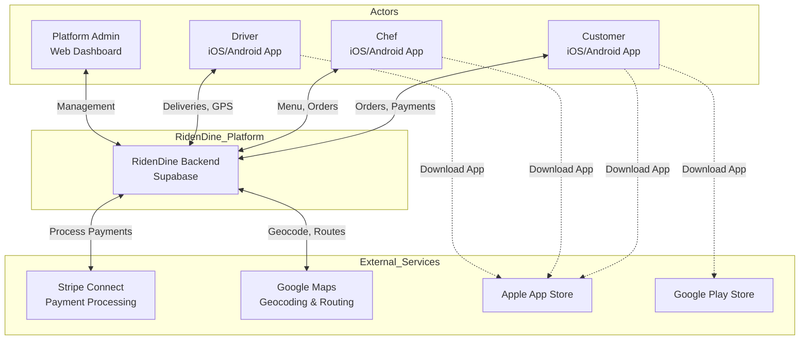
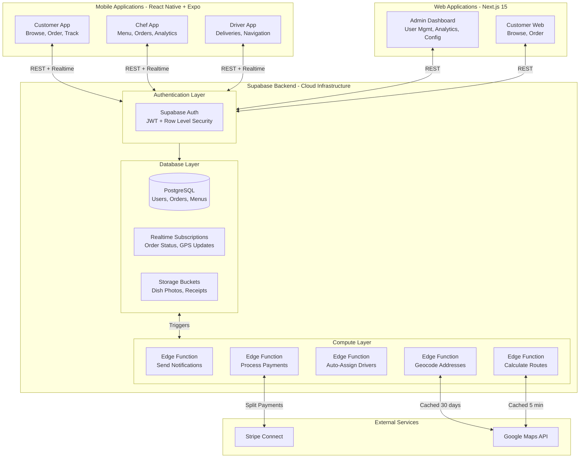
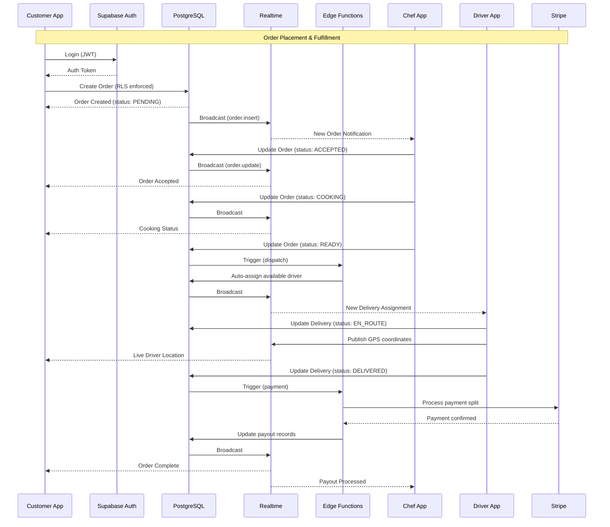
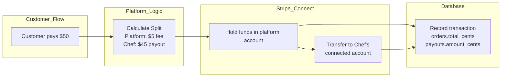
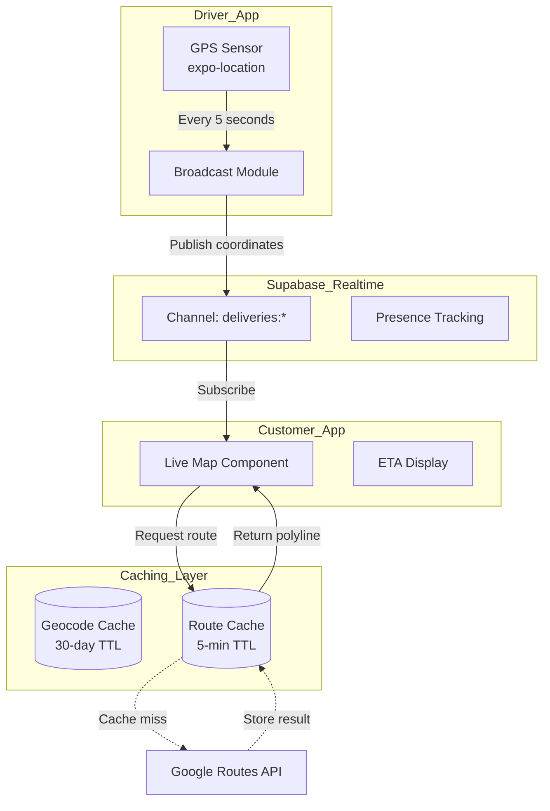
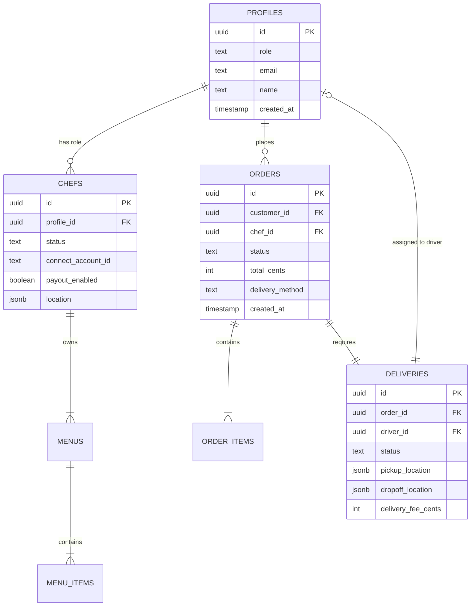
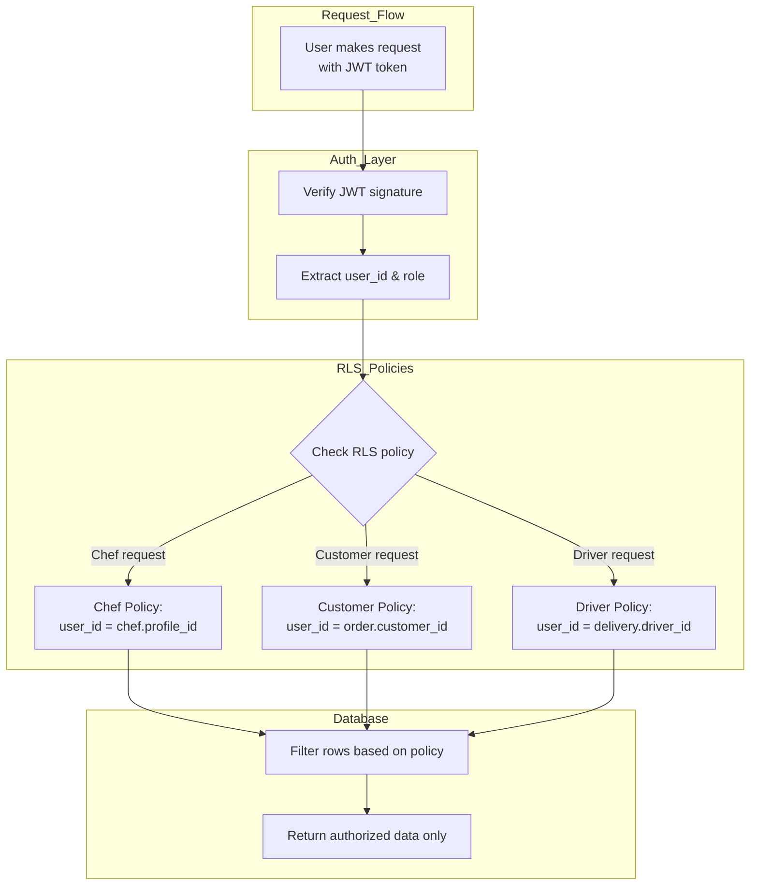
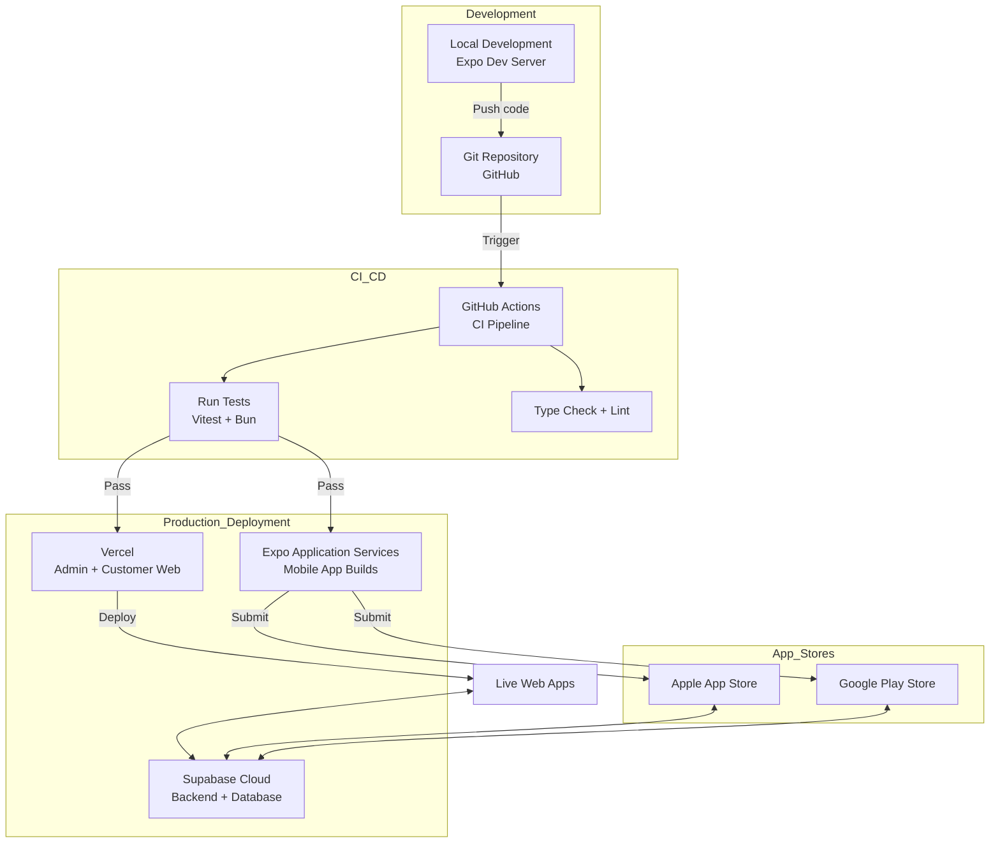
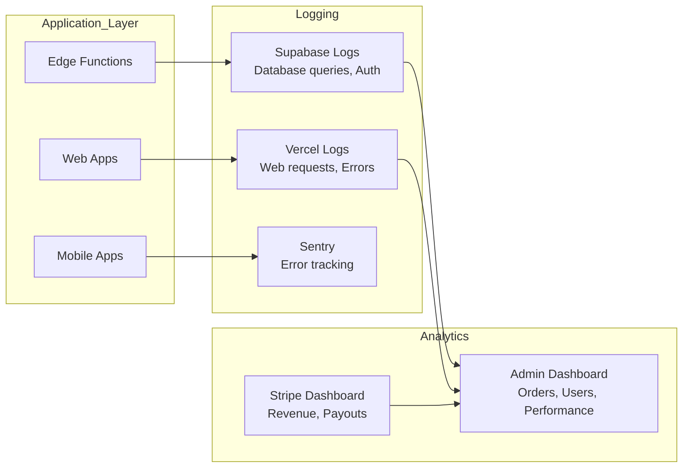
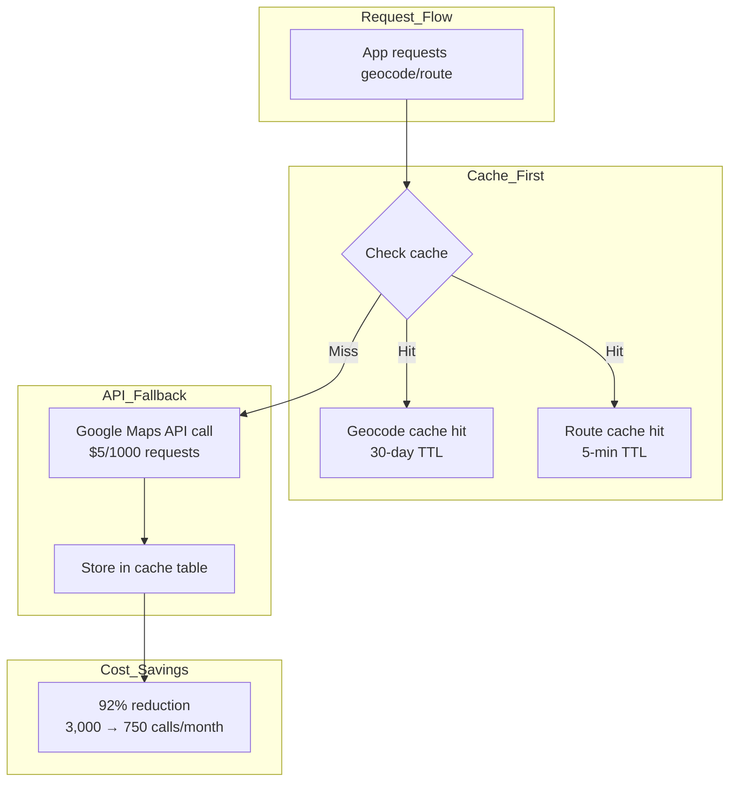

# RidenDine Architecture Diagram

**Generated:** 2026-02-25
**Type:** 3-Sided Marketplace (Customer, Chef/Driver, Admin)
**Pattern:** Real-time Event-Driven Architecture

---

## Level 0: System Context

---

## Level 1: Container Architecture

---

## Level 2: Component Architecture - Order Flow

---

## Level 3: Data Flow - Payment Processing

---

## Level 4: GPS & Real-Time Architecture

---

## Database Schema - Core Tables

---

## Security Model - Row Level Security (RLS)

---

## Deployment Architecture

---

## Monitoring & Observability

---

## Cost Optimization - Google Maps Free Tier

---

## Key Architectural Decisions

| Decision | Rationale | Trade-off |
|----------|-----------|-----------|
| **Supabase Backend** | Managed Postgres + Auth + Realtime out of the box | Vendor lock-in vs speed to market |
| **Monorepo Structure** | Share types/logic across mobile + web | Larger codebase vs code reuse |
| **React Native + Expo** | Single codebase for iOS/Android | Limited native API access vs development speed |
| **RLS for Security** | Database-level authorization | Complex policies vs foolproof security |
| **Stripe Connect** | Built-in marketplace payments | 2.9% + $0.30 + 2% fee vs custom solution |
| **Edge Functions** | Serverless compute at the edge | Cold starts vs no server management |
| **Caching Strategy** | Reduce Google Maps API costs by 92% | Stale data risk vs cost savings |

---

## References

- **C4 Model**: Context → Container → Component → Code
- **Architecture Patterns**: Event-Driven, 3-Sided Marketplace, Real-time Subscriptions
- **Security**: Row Level Security (RLS), JWT Authentication
- **Cost Optimization**: Two-tier caching (geocode 30d, routes 5m)
